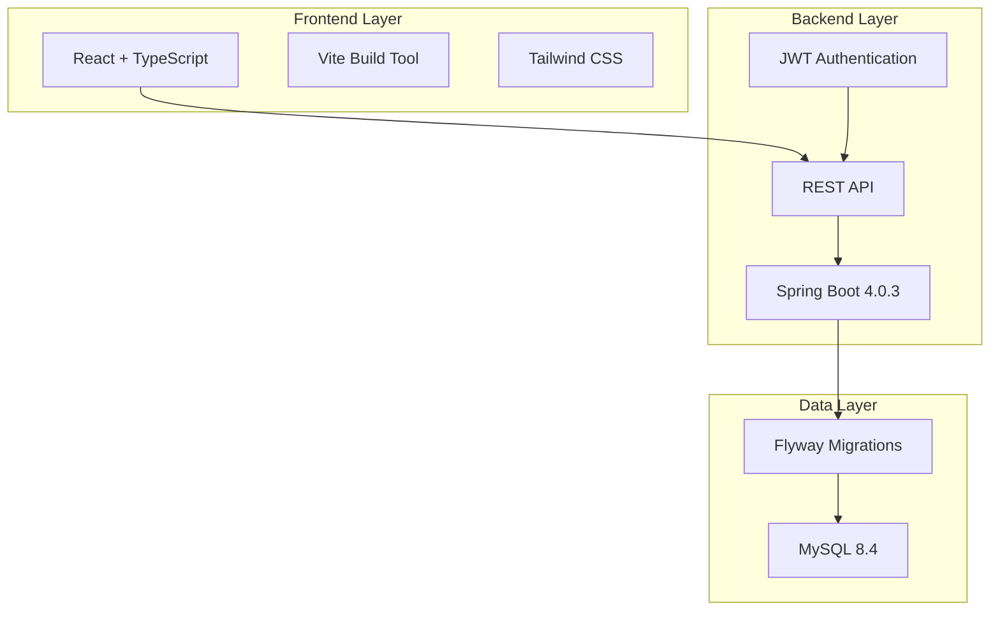
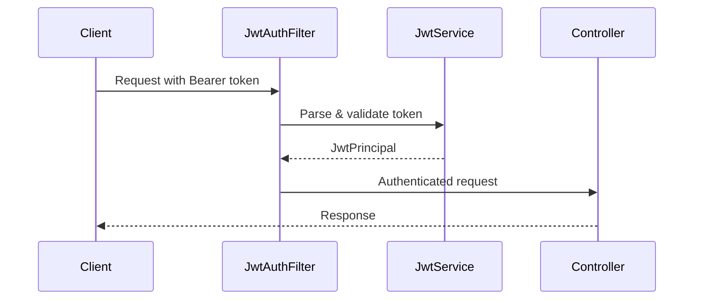
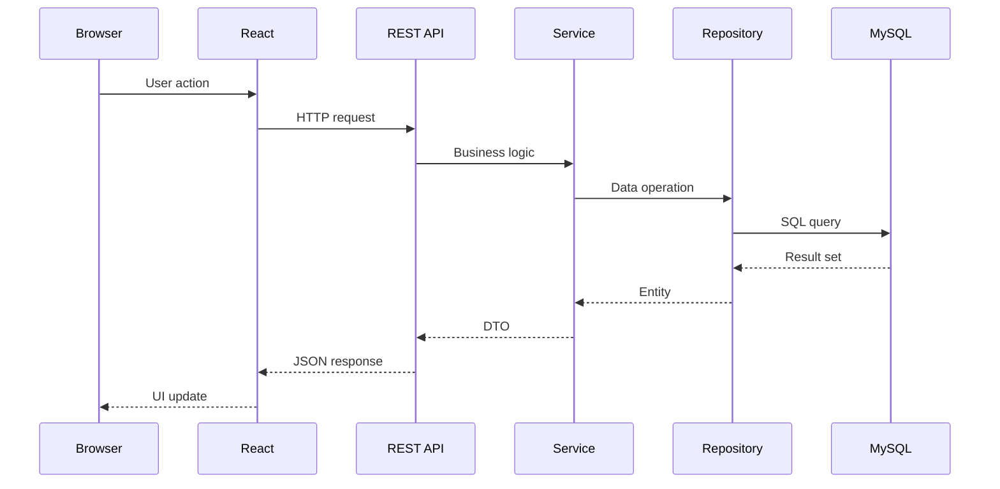
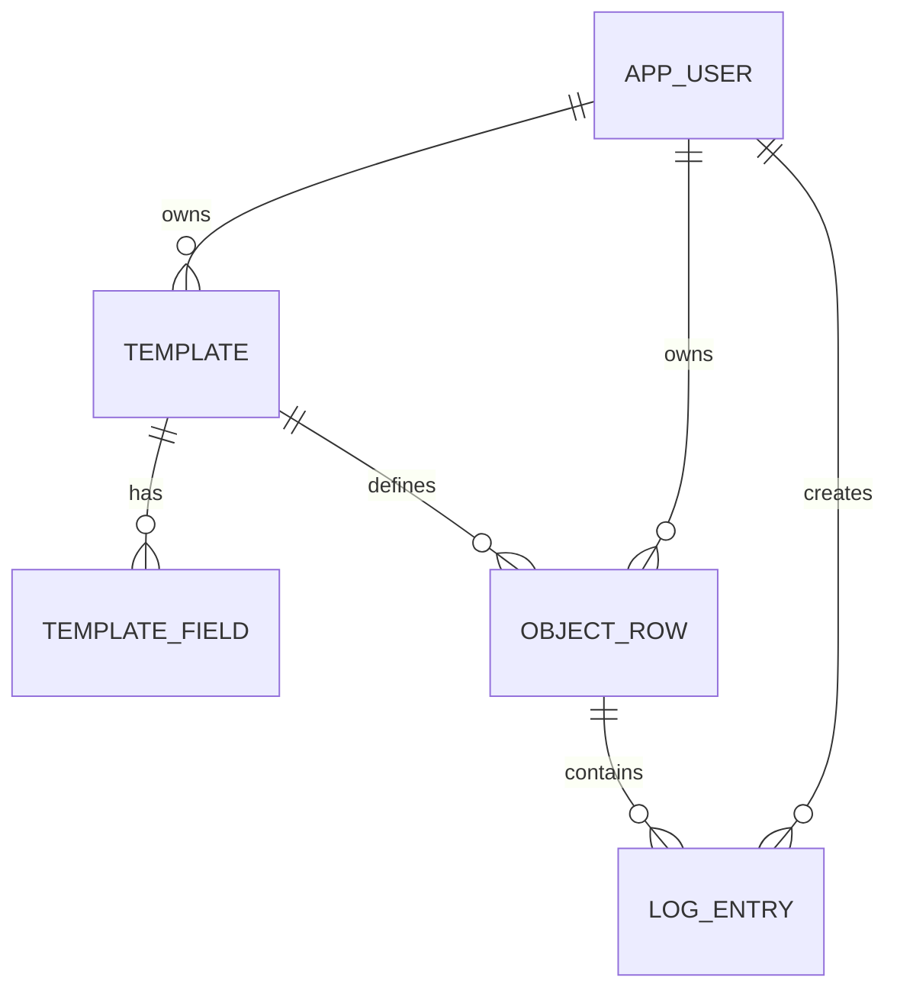

## Overview

Bitácora Universal follows a **layered architecture** with clear separation between the backend API and frontend application. The system is designed for maintainability, scalability, and developer productivity.



## Technology Stack

<CardGroup cols={2}>
  <Card title="Backend" icon="java">
    - **Framework**: Spring Boot 4.0.3
    - **Language**: Java 21
    - **Build Tool**: Maven
    - **Database**: MySQL 8.4
  </Card>
  
  <Card title="Frontend" icon="react">
    - **Framework**: React 19.2.0
    - **Language**: TypeScript 5.9.3
    - **Build Tool**: Vite 7.3.1
    - **Styling**: Tailwind CSS 4.2.1
  </Card>
</CardGroup>

## Backend Architecture

### Package Structure

The backend follows a **domain-driven design** with clear layer separation:

```
bitacora.bitacorauniversal/
├── application/          # Business logic layer
│   ├── auth/            # Authentication services
│   ├── log/             # Log entry services
│   └── template/        # Template management
├── infrastructure/       # External concerns
│   └── persistence/     # Database entities & repositories
├── security/            # Security configuration
│   ├── JwtAuthFilter    # JWT token validation
│   ├── JwtService       # Token generation/parsing
│   └── AuthContext      # Security context utilities
├── web/                 # API layer
│   ├── auth/            # Authentication endpoints
│   ├── log/             # Log management endpoints
│   └── template/        # Template endpoints
├── config/              # Spring configuration
└── shared/              # Shared utilities
    └── errors/          # Exception handling
```

### Key Design Patterns

<Accordion title="Service Layer Pattern">
Business logic is encapsulated in service classes (`AuthService`, `LogService`, `TemplateService`) that coordinate between the web layer and persistence layer.

```java
@Service
public class TemplateService {
    private final TemplateRepository templateRepository;
    
    public TemplateDto createTemplate(CreateTemplateRequest request) {
        // Business logic here
    }
}
```
</Accordion>

<Accordion title="Repository Pattern">
Data access is abstracted through Spring Data JPA repositories, providing clean separation from business logic.

```java
public interface TemplateRepository extends JpaRepository<TemplateEntity, UUID> {
    List<TemplateEntity> findByOwnerIdOrderByCreatedAtDesc(String ownerId);
}
```
</Accordion>

<Accordion title="DTO Pattern">
Data Transfer Objects are used for API requests/responses, keeping internal entities separate from API contracts.

- Request DTOs: `CreateTemplateRequest`, `LoginRequest`
- Response DTOs: `TemplateResponse`, `AuthResponse`
</Accordion>

### Security Architecture

The application uses **JWT-based authentication** with a custom filter chain:



**Key Components:**

- `JwtAuthFilter`: Intercepts requests and validates JWT tokens
- `JwtService`: Handles token generation and parsing (JJWT library)
- `AuthContext`: Provides access to authenticated user information
- Public endpoints: `/api/v1/auth/*` and `/health`

## Frontend Architecture

### Component Structure

```
frontend/src/
├── pages/               # Route-level components
│   ├── Login.tsx
│   └── TemplateDetailPage.tsx
├── components/          # Reusable components
│   ├── ui.tsx          # Base UI components
│   ├── NewTemplateModal.tsx
│   └── NewFieldModal.tsx
├── lib/                 # Utilities & API client
├── assets/              # Static resources
└── App.tsx              # Main application component
```

### State Management

The application uses **React hooks** for state management:

- `useState` for component-local state
- `useEffect` for side effects and data fetching
- JWT tokens stored in `localStorage`

### API Communication

<Accordion title="API Client Pattern">
API calls are centralized in the `lib/` directory with consistent error handling and authentication.

```typescript
const response = await fetch('/api/v1/templates', {
  method: 'POST',
  headers: {
    'Content-Type': 'application/json',
    'Authorization': `Bearer ${token}`
  },
  body: JSON.stringify(data)
});
```
</Accordion>

## Data Flow



## Core Domain Model

The system revolves around four main entities:

<CardGroup cols={2}>
  <Card title="Template" icon="table">
    Defines the structure for trackable items with custom fields.
  </Card>
  
  <Card title="Template Field" icon="input-text">
    Individual fields within a template (text, number, date, etc.).
  </Card>
  
  <Card title="Object Row" icon="database">
    Instances of templates representing tracked items.
  </Card>
  
  <Card title="Log Entry" icon="pen-to-square">
    Individual log entries with scores and comments.
  </Card>
</CardGroup>

### Entity Relationships



## Configuration Management

<Accordion title="Backend Configuration">
Configuration is managed through `application.properties`:

```properties
server.port=8080

spring.datasource.url=jdbc:mysql://127.0.0.1:3307/bitacora
spring.datasource.username=usuario
spring.datasource.password=123

spring.jpa.hibernate.ddl-auto=validate
spring.flyway.enabled=true

app.jwt.secret=TorremolinosMalag@321canelaYmilo
app.jwt.issuer=bitacora-universal
app.jwt.ttl-seconds=604800
```

**Important**: Use environment variables or secrets management in production.
</Accordion>

<Accordion title="Frontend Configuration">
Build and development configuration in `vite.config.ts`:

```typescript
import { defineConfig } from 'vite'
import react from '@vitejs/plugin-react'

export default defineConfig({
  plugins: [react()],
  server: {
    proxy: {
      '/api': 'http://localhost:8080'
    }
  }
})
```
</Accordion>

## Development Principles

<Card title="Clean Architecture" icon="layer-group">
  - **Separation of Concerns**: Each layer has a single responsibility
  - **Dependency Inversion**: Business logic doesn't depend on frameworks
  - **Testability**: Layers can be tested independently
</Card>

<Card title="API-First Design" icon="code">
  - RESTful conventions for all endpoints
  - Consistent error responses
  - JWT authentication for stateless sessions
</Card>

## Related Documentation

<CardGroup cols={2}>
  <Card title="Database Schema" icon="database" href="/development/database">
    Detailed database design and migrations
  </Card>
  
  <Card title="Frontend Guide" icon="browser" href="/development/frontend">
    Frontend development and component patterns
  </Card>
  
  <Card title="Deployment" icon="rocket" href="/development/deployment">
    Deployment strategies and infrastructure
  </Card>
</CardGroup>