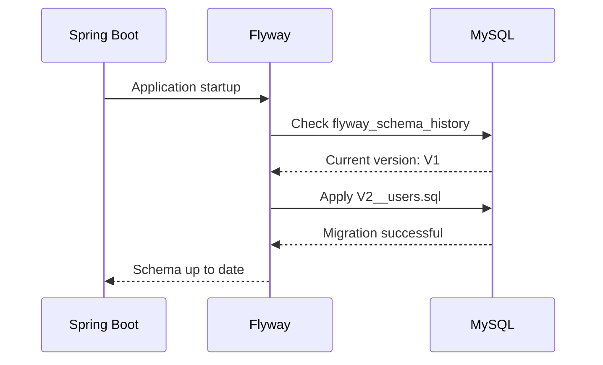

## Overview

Bitácora Universal uses **MySQL 8.4** as its primary database, managed through **Flyway migrations** for version control and schema evolution.

<Card title="Database Configuration" icon="gear">
  - **Engine**: MySQL 8.4
  - **Character Set**: UTF8MB4
  - **Collation**: utf8mb4_0900_ai_ci
  - **Migrations**: Flyway (versioned SQL scripts)
</Card>

## Connection Details

### Development Environment

```properties
spring.datasource.url=jdbc:mysql://127.0.0.1:3307/bitacora
spring.datasource.username=usuario
spring.datasource.password=123
spring.jpa.hibernate.ddl-auto=validate
spring.flyway.enabled=true
```

### Docker Compose Configuration

```yaml
services:
  mysql:
    image: mysql:8.4
    container_name: bitacora-mysql
    environment:
      MYSQL_ROOT_PASSWORD: root
      MYSQL_DATABASE: bitacora
      MYSQL_USER: usuario
      MYSQL_PASSWORD: 123
      TZ: Europe/Madrid
    ports:
      - "3307:3306"
    volumes:
      - mysql_data:/var/lib/mysql
      - ./infra/mysql/my.cnf:/etc/mysql/conf.d/my.cnf:ro
```

<Note>
The database runs on port **3307** (host) mapping to 3306 (container) to avoid conflicts with local MySQL installations.
</Note>

## Schema Overview

The database consists of **5 main tables** representing the core domain model:

```mermaid
erDiagram
    APP_USER ||--o{ TEMPLATE : owns
    APP_USER ||--o{ OBJECT_ROW : owns
    APP_USER ||--o{ LOG_ENTRY : creates
    TEMPLATE ||--o{ TEMPLATE_FIELD : has
    TEMPLATE ||--o{ OBJECT_ROW : instantiates
    OBJECT_ROW ||--o{ LOG_ENTRY : contains
    
    APP_USER {
        binary(16) id PK
        varchar(190) email UK
        varchar(100) password_hash
        timestamp created_at
    }
    
    TEMPLATE {
        binary(16) id PK
        varchar(64) owner_id
        varchar(120) name
        varchar(500) description
        timestamp created_at
        timestamp updated_at
    }
    
    TEMPLATE_FIELD {
        binary(16) id PK
        binary(16) template_id FK
        varchar(60) field_key
        varchar(120) label
        varchar(20) data_type
        boolean required
        json options_json
        int order_index
    }
    
    OBJECT_ROW {
        binary(16) id PK
        varchar(64) owner_id
        binary(16) template_id FK
        varchar(160) display_name
        json values_json
        timestamp created_at
        timestamp updated_at
    }
    
    LOG_ENTRY {
        binary(16) id PK
        varchar(64) owner_id
        binary(16) row_id FK
        decimal(4,2) score
        text comment
        date event_date
        timestamp created_at
    }
```

## Table Definitions

### app_user

Stores user authentication information.

```sql
CREATE TABLE app_user (
  id BINARY(16) NOT NULL,
  email VARCHAR(190) NOT NULL,
  password_hash VARCHAR(100) NOT NULL,
  created_at TIMESTAMP(6) NOT NULL DEFAULT CURRENT_TIMESTAMP(6),
  PRIMARY KEY (id),
  UNIQUE KEY uk_app_user_email (email)
);
```

<Accordion title="Field Details">
| Field | Type | Description |
|-------|------|-------------|
| `id` | BINARY(16) | UUID stored as binary for efficiency |
| `email` | VARCHAR(190) | User's email address (unique) |
| `password_hash` | VARCHAR(100) | BCrypt hashed password |
| `created_at` | TIMESTAMP(6) | Account creation timestamp |
</Accordion>

### template

Defines reusable templates for tracking items.

```sql
CREATE TABLE template (
  id            BINARY(16) NOT NULL,
  owner_id      VARCHAR(64) NOT NULL,
  name          VARCHAR(120) NOT NULL,
  description   VARCHAR(500) NULL,
  created_at    TIMESTAMP(3) NOT NULL DEFAULT CURRENT_TIMESTAMP(3),
  updated_at    TIMESTAMP(3) NOT NULL DEFAULT CURRENT_TIMESTAMP(3) ON UPDATE CURRENT_TIMESTAMP(3),
  PRIMARY KEY (id),
  UNIQUE KEY uk_template_owner_name (owner_id, name)
) ENGINE=InnoDB DEFAULT CHARSET=utf8mb4 COLLATE=utf8mb4_0900_ai_ci;
```

<Accordion title="Key Features">
- **Unique constraint** on `(owner_id, name)` prevents duplicate template names per user
- **Soft timestamps** with automatic `updated_at` on row modification
- Optional `description` field for documentation
</Accordion>

### template_field

Defines individual fields within a template.

```sql
CREATE TABLE template_field (
  id            BINARY(16) NOT NULL,
  template_id   BINARY(16) NOT NULL,
  field_key     VARCHAR(60) NOT NULL,
  label         VARCHAR(120) NOT NULL,
  data_type     VARCHAR(20) NOT NULL,
  required      BOOLEAN NOT NULL DEFAULT FALSE,
  options_json  JSON NULL,
  order_index   INT NOT NULL DEFAULT 0,
  created_at    TIMESTAMP(3) NOT NULL DEFAULT CURRENT_TIMESTAMP(3),
  updated_at    TIMESTAMP(3) NOT NULL DEFAULT CURRENT_TIMESTAMP(3) ON UPDATE CURRENT_TIMESTAMP(3),
  PRIMARY KEY (id),
  CONSTRAINT fk_field_template
    FOREIGN KEY (template_id) REFERENCES template(id)
      ON DELETE CASCADE,
  UNIQUE KEY uk_field_template_key (template_id, field_key),
  KEY ix_field_template_order (template_id, order_index),
  CONSTRAINT ck_field_datatype
    CHECK (data_type IN ('TEXT','NUMBER','BOOLEAN','DATE','SELECT'))
) ENGINE=InnoDB DEFAULT CHARSET=utf8mb4 COLLATE=utf8mb4_0900_ai_ci;
```

<Accordion title="Data Types">
| Type | Description | Example |
|------|-------------|----------|
| `TEXT` | Free-form text input | "Project notes" |
| `NUMBER` | Numeric values | 42, 3.14 |
| `BOOLEAN` | True/false values | true, false |
| `DATE` | Date values | "2026-03-06" |
| `SELECT` | Dropdown options | Stored in `options_json` |
</Accordion>

<Accordion title="Indexes">
- **Primary Key**: `id` for fast lookups
- **Unique Key**: `(template_id, field_key)` prevents duplicate field keys
- **Index**: `(template_id, order_index)` for ordered field retrieval
</Accordion>

### object_row

Instances of templates representing tracked items.

```sql
CREATE TABLE object_row (
  id            BINARY(16) NOT NULL,
  owner_id      VARCHAR(64) NOT NULL,
  template_id   BINARY(16) NOT NULL,
  display_name  VARCHAR(160) NOT NULL,
  values_json   JSON NOT NULL,
  created_at    TIMESTAMP(3) NOT NULL DEFAULT CURRENT_TIMESTAMP(3),
  updated_at    TIMESTAMP(3) NOT NULL DEFAULT CURRENT_TIMESTAMP(3) ON UPDATE CURRENT_TIMESTAMP(3),
  PRIMARY KEY (id),
  CONSTRAINT fk_row_template
    FOREIGN KEY (template_id) REFERENCES template(id)
      ON DELETE CASCADE,
  KEY ix_row_owner_template_created (owner_id, template_id, created_at)
) ENGINE=InnoDB DEFAULT CHARSET=utf8mb4 COLLATE=utf8mb4_0900_ai_ci;
```

<Accordion title="JSON Storage">
The `values_json` field stores dynamic field values as JSON:

```json
{
  "project_name": "Website Redesign",
  "priority": 8,
  "active": true,
  "start_date": "2026-01-15"
}
```

This schema-less approach allows flexible data storage without schema migrations for new fields.
</Accordion>

<Accordion title="Performance Index">
Composite index `(owner_id, template_id, created_at)` optimizes common queries:
- Fetching all rows for a user's template
- Ordering by creation date
</Accordion>

### log_entry

Individual log entries with scores and comments.

```sql
CREATE TABLE log_entry (
  id            BINARY(16) NOT NULL,
  owner_id      VARCHAR(64) NOT NULL,
  row_id        BINARY(16) NOT NULL,
  score         DECIMAL(4,2) NOT NULL,
  comment       TEXT NOT NULL,
  event_date    DATE NULL,
  created_at    TIMESTAMP(3) NOT NULL DEFAULT CURRENT_TIMESTAMP(3),
  PRIMARY KEY (id),
  CONSTRAINT fk_log_row
    FOREIGN KEY (row_id) REFERENCES object_row(id)
      ON DELETE CASCADE,
  KEY ix_log_owner_row_created (owner_id, row_id, created_at),
  CONSTRAINT ck_log_score_range
    CHECK (score >= 0.00 AND score <= 10.00)
) ENGINE=InnoDB DEFAULT CHARSET=utf8mb4 COLLATE=utf8mb4_0900_ai_ci;
```

<Accordion title="Score Validation">
The `score` field is constrained to **0.00 - 10.00** using a CHECK constraint:

```sql
CONSTRAINT ck_log_score_range
  CHECK (score >= 0.00 AND score <= 10.00)
```

This ensures data integrity at the database level.
</Accordion>

## Migration Strategy

Flyway manages database schema evolution through versioned SQL scripts.

### Migration Files

Located in `backend/src/main/resources/db/migration/`:

```
db/migration/
├── V1__init.sql          # Initial schema (templates, fields, rows, logs)
└── V2__users.sql         # User authentication table
```

### Migration Workflow



<Accordion title="V1__init.sql">
Creates the core domain tables:
- `template`
- `template_field`
- `object_row`
- `log_entry`

Establishes foreign key relationships and indexes.
</Accordion>

<Accordion title="V2__users.sql">
Adds user authentication:
- `app_user` table
- Email uniqueness constraint
- BCrypt password storage
</Accordion>

### Best Practices

<Card title="Migration Guidelines" icon="list-check">
  1. **Never modify existing migrations** - Create new ones instead
  2. **Use semantic versioning** - `V{version}__{description}.sql`
  3. **Test migrations locally** before deploying
  4. **Include rollback scripts** for production environments
  5. **Keep migrations idempotent** when possible
</Card>

## Data Types & Conventions

### UUID Storage

UUIDs are stored as `BINARY(16)` for efficiency:

```java
@Converter(autoApply = true)
public class UuidBinaryConverter implements AttributeConverter<UUID, byte[]> {
    @Override
    public byte[] convertToDatabaseColumn(UUID uuid) {
        // Convert UUID to bytes
    }
    
    @Override
    public UUID convertToEntityAttribute(byte[] bytes) {
        // Convert bytes to UUID
    }
}
```

**Benefits:**
- 16 bytes vs 36 characters (VARCHAR)
- Faster indexing and joins
- Reduced storage requirements

### JSON Fields

<Accordion title="template_field.options_json">
Stores configuration for SELECT fields:

```json
{
  "options": ["Low", "Medium", "High", "Critical"]
}
```
</Accordion>

<Accordion title="object_row.values_json">
Stores dynamic field values:

```json
{
  "field_key_1": "value",
  "field_key_2": 42,
  "field_key_3": true
}
```
</Accordion>

### Timestamp Precision

- **Microseconds** (`TIMESTAMP(6)`): `app_user.created_at`
- **Milliseconds** (`TIMESTAMP(3)`): All other timestamps

## Indexes & Performance

<CardGroup cols={2}>
  <Card title="Primary Keys" icon="key">
    All tables use `BINARY(16)` UUIDs as primary keys for distributed systems compatibility.
  </Card>
  
  <Card title="Foreign Keys" icon="link">
    Cascade deletes ensure referential integrity (e.g., deleting a template removes all fields).
  </Card>
  
  <Card title="Composite Indexes" icon="layer-group">
    Optimize common query patterns like filtering by owner and template.
  </Card>
  
  <Card title="Unique Constraints" icon="shield-check">
    Prevent duplicate data (e.g., one template name per user).
  </Card>
</CardGroup>

## MySQL Configuration

Custom configuration in `infra/mysql/my.cnf`:

```ini
[mysqld]
max_connections=50
innodb_buffer_pool_size=128M
innodb_log_buffer_size=16M
innodb_log_file_size=64M
tmp_table_size=32M
max_heap_table_size=32M

sql_mode=STRICT_TRANS_TABLES,ERROR_FOR_DIVISION_BY_ZERO,NO_ENGINE_SUBSTITUTION
character-set-server=utf8mb4
collation-server=utf8mb4_0900_ai_ci
```

<Accordion title="Configuration Highlights">
| Setting | Value | Purpose |
|---------|-------|----------|
| `max_connections` | 50 | Limit concurrent connections |
| `innodb_buffer_pool_size` | 128M | Memory for caching data |
| `character-set-server` | utf8mb4 | Full Unicode support |
| `collation-server` | utf8mb4_0900_ai_ci | Case-insensitive comparisons |
</Accordion>

## Querying Examples

<Accordion title="Get all templates for a user">
```sql
SELECT * FROM template 
WHERE owner_id = ? 
ORDER BY created_at DESC;
```
</Accordion>

<Accordion title="Get template with fields">
```sql
SELECT t.*, f.*
FROM template t
LEFT JOIN template_field f ON f.template_id = t.id
WHERE t.id = ?
ORDER BY f.order_index;
```
</Accordion>

<Accordion title="Get logs for an object row">
```sql
SELECT * FROM log_entry
WHERE row_id = ?
ORDER BY created_at DESC;
```
</Accordion>

## Related Documentation

<CardGroup cols={2}>
  <Card title="Architecture" icon="sitemap" href="/development/architecture">
    Overall system architecture and design patterns
  </Card>
  
  <Card title="API Reference" icon="code" href="/api/overview">
    REST API endpoints and data models
  </Card>
</CardGroup>