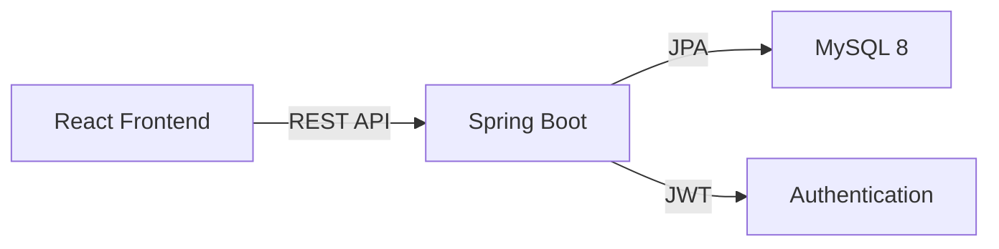

Get your Bitácora Universal instance running and create your first template in under 10 minutes.

## Prerequisites

Before you begin, ensure you have the following installed:

- **Docker & Docker Compose** - For running MySQL
- **Java 21+** - Required for Spring Boot 4
- **Node.js 18+** - For the React frontend
- **Maven 3.6+** - For building the backend

## Quick Start Guide

<Steps>
  <Step title="Clone and Navigate to Project">
    Clone the repository and navigate to the project directory:

    ```bash
    git clone <your-repo-url>
    cd bitacora-universal
    ```
  </Step>

  <Step title="Start MySQL Database">
    Launch MySQL using Docker Compose:

    ```bash
    docker compose up -d
    ```

    Verify the database is running:

    ```bash
    docker compose ps
    ```

    You should see `bitacora-mysql` with status "Up".

    <Note>
      The MySQL container runs on port **3307** (not the default 3306) to avoid conflicts with existing MySQL installations.
    </Note>
  </Step>

  <Step title="Start the Backend">
    Navigate to the backend directory and run the Spring Boot application:

    ```bash
    cd backend
    ./mvnw spring-boot:run
    ```

    The backend will:
    - Start on port **8080**
    - Automatically run Flyway migrations to set up the database schema
    - Initialize JWT authentication with the configured secret

    <Note>
      Wait for the message `Started BitacoraUniversalApplication` before proceeding.
    </Note>
  </Step>

  <Step title="Start the Frontend">
    Open a new terminal, navigate to the frontend directory, and start the development server:

    ```bash
    cd frontend
    npm install
    npm run dev
    ```

    The frontend will start on **http://localhost:5173**
  </Step>

  <Step title="Create Your First Account">
    Open your browser and navigate to **http://localhost:5173**

    You'll see the login page. Click **"Crear cuenta"** (Create account) and register with:

    - **Email**: your@email.com
    - **Password**: Choose a secure password

    <Note>
      The default login page includes pre-filled test credentials (`daniel@test.com` / `123456`), but you should create your own account.
    </Note>
  </Step>

  <Step title="Create Your First Template">
    Once logged in, you'll see the main dashboard. Click **"Crear plantilla"** (Create template):

    1. **Name**: "My Cars" (or any category you want to track)
    2. **Description**: "Track my vehicle collection"
    3. Click **Create**

    Your template is now ready!
  </Step>

  <Step title="Add Custom Fields">
    Open your template and add custom fields to define your data structure:

    Click **"Add Field"** and create fields like:

    - **Field Key**: `brand`
      - **Label**: Brand
      - **Type**: TEXT
      - **Required**: Yes

    - **Field Key**: `year`
      - **Label**: Year
      - **Type**: NUMBER
      - **Required**: No

    - **Field Key**: `fuel_type`
      - **Label**: Fuel Type
      - **Type**: SELECT
      - **Options**: Gasoline, Diesel, Electric, Hybrid

    <Note>
      Available field types: `TEXT`, `NUMBER`, `BOOLEAN`, `DATE`, `SELECT`
    </Note>
  </Step>

  <Step title="Add Your First Record">
    With fields defined, add your first record (row):

    1. Click **"Add Row"**
    2. Fill in the values for each field
    3. Give it a **display name** (e.g., "Tesla Model 3")
    4. Save the record

    Your first entry is now stored in Bitácora!
  </Step>

  <Step title="Track History with Logs">
    Each record can have log entries with scores from 0-10:

    1. Open any record
    2. Click **"Add Log"**
    3. Enter a **score** (0.00 - 10.00)
    4. Add a **comment** about this entry
    5. Optionally set an **event date**

    This allows you to track the history and performance of any item over time.
  </Step>
</Steps>

## What's Next?

<CardGroup cols={2}>
  <Card title="Installation Guide" icon="download" href="/installation">
    Detailed setup instructions for production deployment
  </Card>
  
  <Card title="API Reference" icon="code" href="/api/overview">
    Explore the REST API endpoints and authentication
  </Card>
  
  <Card title="Templates" icon="table" href="/features/templates">
    Learn how to design powerful template structures
  </Card>
  
  <Card title="Security" icon="lock" href="/guides/authentication">
    Configure JWT authentication and user management
  </Card>
</CardGroup>

## Common Issues

<Warning>
  **Port conflicts**: If port 3307 or 8080 are already in use, you'll need to modify:
  - `docker-compose.yml` for MySQL port
  - `application.properties` for backend port
</Warning>

### Database Connection Failed

If the backend can't connect to MySQL:

```bash
# Check if MySQL is running
docker compose ps

# View MySQL logs
docker compose logs mysql

# Restart the database
docker compose restart mysql
```

### Frontend API Connection Issues

If the frontend can't reach the backend, verify the API base URL:

```typescript
// frontend/src/lib/api.ts
const API_BASE = import.meta.env.VITE_API_BASE ?? "http://localhost:8080";
```

You can override this by creating a `.env` file in the frontend directory:

```bash
VITE_API_BASE=http://localhost:8080
```

## Architecture Overview

Bitácora Universal follows a clean architecture pattern:

- **Frontend**: React 19 + TypeScript + Vite + Tailwind CSS
- **Backend**: Spring Boot 4 + Java 21 + Spring Security
- **Database**: MySQL 8 with Flyway migrations
- **Authentication**: JWT with 7-day expiration



## Development Tips

- **Hot reload**: Both frontend (Vite) and backend (Spring DevTools) support hot reload
- **Database changes**: Use Flyway migrations in `backend/src/main/resources/db/migration/`
- **API testing**: Backend runs on `http://localhost:8080/api/v1/`
- **Health check**: Visit `http://localhost:8080/health` to verify backend status

<Note>
  The application uses **BINARY(16)** UUIDs for all primary keys, ensuring globally unique identifiers.
</Note>